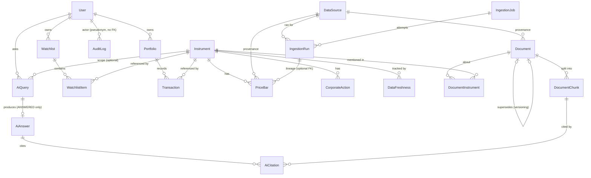

# MarketMind AI -- Data Model (Phase 1.1)

Related: [overview.md](./overview.md) · [decisions.md](./decisions.md) · [security.md](./security.md)

Status: **Phase 1.1 -- Architecture finalised**. This is a design, not a Prisma schema. Names and types are indicative; exact column lists are finalised during implementation.

Tags: **[Recommendation]** proposed here · **[Assumption]** unverified · **[Accepted]** closed in Phase 1.1 review · **[Provisional]** placeholder value requiring validation.

---

## 1. Conventions

| Topic | Convention |
|---|---|
| Primary keys | **[Accepted: DR-10]** UUIDv4 for all entity tables. Never expose sequential integers publicly. UUIDv7 is noted as a future improvement if the host runs PostgreSQL 17+; at MVP data volumes index fragmentation from UUIDv4 randomness is not a measurable concern. |
| Instants | `timestamptz` in UTC. In Prisma: `DateTime @db.Timestamptz(3)` -- the Prisma default on PostgreSQL is `timestamp` **without** time zone **[Assumption: verify on the installed Prisma version]**. |
| Trade dates | `DATE` (`@db.Date`) interpreted as the **IST exchange trading date**. Never derive trade dates from UTC instants without converting to IST. |
| Audit columns | `createdAt` (default `now()`), `updatedAt` on mutable tables. Immutable/append-only tables have `createdAt`/`occurredAt` only. |
| Money / prices | `NUMERIC(18,4)` (up to 14 integer digits, 4 fractional). Never `FLOAT`/`DOUBLE`. |
| Quantities | `NUMERIC(18,4)` (supports fractional units; integer-only enforced at app level if desired). |
| Ratios (split/bonus) | `NUMERIC(18,8)`. |
| Volume | `BIGINT`. |
| Percentages/weights | Derived at read time as Decimal; if ever stored, `NUMERIC(9,6)` as a fraction (0-1), not 0-100. |
| Currency | `CHAR(3)` ISO code on portfolios (`INR` in MVP) to avoid a later migration. |
| Enums | PostgreSQL enums via Prisma, or `TEXT` + CHECK constraint when values may change often. Recommendation: enums for stable sets (exchange, job status), text+CHECK for evolving ones (audit action). |
| Soft delete | Not used for user data in MVP (hard delete supports deletion requests). Instruments use a `status` lifecycle instead. |
| Deletion cascade | User deletion cascades to user-owned data; shared reference data is never cascaded from users. |
| Case-insensitive emails | Normalise to lower-case at write and enforce a unique index on the normalised value (or `citext` if the host supports the extension). |

---

## 2. Ownership boundaries

| Class | Tables | Who may read | Who may write |
|---|---|---|---|
| **Shared reference/market data** | Instrument, PriceBar, CorporateAction, DataSource, Document, DocumentInstrument, DocumentChunk, DataFreshness | Any authenticated user (subject to `licenseRestriction`) | Worker/ingestion only. Never user-writable. |
| **User-owned** | Portfolio, Transaction, Watchlist, WatchlistItem, AiQuery, AiAnswer, AiCitation | Owner only | Owner only |
| **Operational** | IngestionJob, IngestionRun | Admin role | Worker; admin (re-queue) |
| **Security** | User + auth-library tables, AuditLog, RateLimitBucket | Auth library / admin / system | System only; AuditLog append-only |

Every user-owned row is reachable to a `userId` either directly or via a single, documented parent join. Authorisation tests enumerate each path.

---

## 3. Entity-relationship diagram



---

## 4. Entities

Columns marked **PK**, **FK**, **UQ**. "Index" lists secondary indexes beyond PK/UQ.

### 4.1 Identity

**User** (shape partly dictated by the chosen auth library -- U-08)
| Column | Type | Notes |
|---|---|---|
| id | uuid PK | UUIDv4 |
| email | text | normalised lower-case; **UQ** |
| emailVerifiedAt | timestamptz? | |
| name | text? | |
| role | enum(`USER`,`ADMIN`) | default `USER`; `ADMIN` assigned out-of-band, never via public API |
| createdAt, updatedAt | timestamptz | |
| disabledAt | timestamptz? | allows account suspension without deletion |

Auth-library tables (accounts, sessions, verification tokens or equivalent) follow the library's schema; **session tokens are stored hashed if the library supports it** and have expiry. Password hashes (if used) use the library's recommended memory-hard algorithm. These tables are excluded from every DTO.

### 4.2 Market data (shared)

**DataSource**
| Column | Type | Notes |
|---|---|---|
| id | uuid PK | |
| key | text | **UQ**, e.g. adapter identifier |
| kind | enum(`MARKET_DATA`,`NEWS`,`DISCLOSURE`) | |
| displayName | text | |
| licenseNote | text | summary + terms URL; required before `enabled=true` |
| licenseReviewedAt | timestamptz? | `enabled` cannot be true while null (CHECK) |
| allowsStorage / allowsDisplay / allowsAiProcessing | boolean | explicit, default false |
| enabled | boolean | |
| createdAt, updatedAt | timestamptz | |

**Instrument**
| Column | Type | Notes |
|---|---|---|
| id | uuid PK | UUIDv4 |
| exchange | enum(`NSE`,`BSE`) | |
| symbol | text | exchange symbol at time of ingest |
| isin | text? | 12 chars; Index |
| name | text | |
| type | enum(`EQUITY`,`ETF`,`INDEX`) | |
| status | enum(`ACTIVE`,`SUSPENDED`,`DELISTED`) | |
| sector, industry | text? | only if a classification source is validated (U-06) |
| createdAt, updatedAt | timestamptz | |

Constraints/indexes: **UQ (exchange, symbol)**; index on `isin`; search index on name/symbol (trigram `pg_trgm` or FTS -- **[Assumption]** extension availability depends on host; fallback `ILIKE` with prefix index is acceptable at this scale). Surrogate `id` used everywhere because tickers can change.

**PriceBar** (daily OHLCV; the largest table)
| Column | Type | Notes |
|---|---|---|
| instrumentId | uuid FK -> Instrument | |
| tradeDate | date | IST trading date |
| open, high, low, close | numeric(18,4) | raw (unadjusted) unless U-04 resolves otherwise |
| adjClose | numeric(18,4)? | only if the source supplies it |
| volume | bigint | >= 0 |
| sourceId | uuid FK -> DataSource | provenance |
| ingestionRunId | uuid FK? -> IngestionRun | lineage; see retention note below |
| ingestedAt | timestamptz | |

Constraints: **PK (instrumentId, tradeDate)**; CHECK `low <= LEAST(open, close)` and `high >= GREATEST(open, close)` and `volume >= 0` and all prices `> 0`. The PK doubles as the range-scan index.
Trade-off: one canonical series per instrument (latest source wins on conflict, `sourceId` records who).
**IngestionRun lineage -- [Accepted: DM-07 clarified]:** `ingestionRunId` is an optional FK. The ERD notation reflects a many-PriceBars to one-IngestionRun relationship (optional on PriceBar side). If an IngestionRun row is purged under the retention policy (U-12), its FK on PriceBar rows **is SET NULL** (not cascaded); bars are retained, lineage is lost. This must be expressed as `ON DELETE SET NULL` in the migration.

**CorporateAction**
| Column | Type | Notes |
|---|---|---|
| id | uuid PK | |
| instrumentId | uuid FK | |
| type | enum(`SPLIT`,`BONUS`,`DIVIDEND`,`RIGHTS`,`OTHER`) | |
| exDate | date | |
| ratioNumerator, ratioDenominator | numeric(18,8)? | for split/bonus |
| amount | numeric(18,4)? | dividend per share |
| sourceId | uuid FK | |
| createdAt | timestamptz | |

**UQ (instrumentId, type, exDate)**; Index (instrumentId, exDate). Adjusted series computed at read time from raw bars + actions, unless the source supplies adjusted prices (U-04).

**DataFreshness** (cheap reads for badges)
| Column | Type | Notes |
|---|---|---|
| id | uuid PK | |
| dataset | enum(`PRICES_DAILY`,`CORPORATE_ACTIONS`,`NEWS`,`DISCLOSURES`,`INSTRUMENT_MASTER`) | |
| instrumentId | uuid? FK | null = dataset-wide |
| lastAttemptAt | timestamptz? | |
| lastSuccessAt | timestamptz? | **authoritative timestamp** for freshness logic |
| lastDataDate | date? | **authoritative** latest trade date / document date present |
| consecutiveFailures | int | default 0; **authoritative** failure count |
| state | enum(`FRESH`,`STALE`,`FAILING`,`UNKNOWN`) | **worker-written cache only** -- see authority rules in overview.md section 5 |

**[Accepted: DM-02 closed]** `state` is a convenience cache. The application reads it for badge display only. Programmatic freshness decisions must re-derive from `lastSuccessAt`, `lastDataDate`, and `consecutiveFailures`. The worker rewrites `state` after every run using the recomputation rules in overview.md section 5.

**UQ (dataset, instrumentId)** with a partial UQ on `(dataset) WHERE instrumentId IS NULL`.

### 4.3 Research documents (shared)

**Document**
| Column | Type | Notes |
|---|---|---|
| id | uuid PK | |
| sourceId | uuid FK -> DataSource | |
| kind | enum(`NEWS`,`DISCLOSURE`) | |
| url | text | as retrieved |
| canonicalUrlHash | text | hash of normalised URL |
| title | text | |
| publisher | text? | |
| publishedAt | timestamptz? | |
| fetchedAt | timestamptz | |
| contentHash | text? | SHA-256 of stored plain text; detects re-fetch changes |
| licenseRestriction | enum(`FULL_TEXT`,`SNIPPET_ONLY`,`LINK_ONLY`) | copied from source policy at ingest |
| language | text? | |
| status | enum(`ACTIVE`,`REMOVED`) | |
| supersededById | uuid? FK -> Document (self) | set when this document is replaced by a newer version |

**[Accepted: DM-05 closed] -- Document versioning and changed-content handling:**

When a re-fetch produces a different `contentHash` (i.e. the source document has changed):
1. The **old Document row** is updated: `status = 'REMOVED'`, `supersededById` = new document id.
2. A **new Document row** is created with the updated content, a new `contentHash`, a new `fetchedAt`, and `status = 'ACTIVE'`. It gets a fresh set of `DocumentChunk` rows.
3. The old Document's chunks are **not deleted**. They become read-only (`status = 'REMOVED'` on the parent Document). Existing `AiCitation` rows that reference those chunks remain valid; the UI shows "source updated" or "source no longer available" depending on the chunk's parent Document status.
4. The old Document's `status = 'REMOVED'` makes it invisible to the retrieval query but visible to citation resolution.

This ensures existing citations remain traceable even after the source document changes. Retention policy (U-12) governs when removed documents and their chunks may eventually be purged; no purge may occur while an AiCitation references those chunks without first setting `documentChunkId = NULL` and leaving the stored `quote` intact.

**UQ (sourceId, canonicalUrlHash)** scoped to `status = 'ACTIVE'` only (partial unique index in raw SQL migration, since superseded versions may share the same URL). Index (publishedAt DESC), (kind, publishedAt DESC).
Only **sanitised plain text** stored (HTML stripped, scripts/styles removed, length capped). Raw HTML not retained.

**DocumentInstrument** (many-to-many): PK (documentId, instrumentId); Index (instrumentId, documentId); include `relevance` (smallint, nullable) and `matchedBy` (`TICKER`,`NAME`,`ISIN`,`SOURCE_TAG`) for auditability.

**DocumentChunk** (immutable once written)
| Column | Type | Notes |
|---|---|---|
| id | uuid PK | |
| documentId | uuid FK (cascade on active doc deletion only -- see retention policy) | |
| ordinal | int | |
| text | text | length-capped |
| textHash | text | SHA-256 of normalised text; stored in AiCitation for citation integrity |
| tsv | tsvector (`Unsupported` in Prisma) | generated from `text` for full-text search |

**[Accepted: SIMPL-06 resolved]** The `tsv` tsvector column and its GIN index are managed via hand-written SQL migration. All FTS queries on DocumentChunk use `$queryRaw` with tagged-template parameters. All such raw SQL query locations are documented centrally in `src/modules/research/repository.ts` with a comment index. A Postgres generated column or trigger may be used to keep `tsv` in sync with `text`; the choice is made during Week 7-8 implementation.

**UQ (documentId, ordinal)**; **GIN index on `tsv`** (raw SQL migration).

### 4.4 Watchlists (user-owned)

**Watchlist**: id PK, userId FK (cascade), name, createdAt, updatedAt. **UQ (userId, name)**. Index (userId).
**WatchlistItem**: watchlistId FK (cascade), instrumentId FK, addedAt, position int?. **PK (watchlistId, instrumentId)**. Index (instrumentId).
Ownership: item -> watchlist -> userId. Services must verify the watchlist belongs to the caller before any item operation. App-level caps (watchlists per user, items per list) prevent abuse.

### 4.5 Portfolio (user-owned)

**Portfolio**: id PK, userId FK (cascade), name, baseCurrency char(3) default `INR`, createdAt, updatedAt. **UQ (userId, name)**. Index (userId).

**Transaction** (immutable-ish ledger; edits audited)
| Column | Type | Notes |
|---|---|---|
| id | uuid PK | UUIDv4 |
| portfolioId | uuid FK (cascade) | |
| **userId** | **uuid FK (NOT NULL)** | **[Accepted: DM-04 closed]** Direct ownership field; defence-in-depth. See note below. |
| instrumentId | uuid FK | |
| type | enum(`BUY`,`SELL`) | corporate-action adjustments open (U-11) |
| tradeDate | date | not in the future |
| quantity | numeric(18,4) | CHECK > 0 |
| price | numeric(18,4) | CHECK > 0 |
| fees | numeric(18,4) | CHECK >= 0, default 0 |
| note | text? | length-capped; rendered escaped |
| createdAt, updatedAt | timestamptz | |

**[Accepted: DM-04 closed]** `userId` is a **required** column on Transaction, not optional. A composite FK `(portfolioId, userId) -> Portfolio (id, userId)` (requires adding `userId` to Portfolio's unique set) ensures a transaction cannot reference a portfolio owned by a different user even through a bug. This must be implemented as part of the portfolio migration in Week 6. Adding it later would require a non-trivial migration on a write-heavy table.

Index (portfolioId, instrumentId, tradeDate). Optional `clientRequestId` with **UQ (portfolioId, clientRequestId)** for idempotent submissions. Invariant enforced in service + tested: cumulative SELL quantity never exceeds cumulative BUY quantity at any point in time per instrument.

### 4.6 Portfolio calculations (derived, never stored)

**[Accepted: DR-08 closed]** Cost-basis method: **weighted-average cost** for MVP.

Formula (to be documented in `src/modules/portfolio/domain/cost-basis.ts`):

```
For each instrument in the portfolio, process transactions in chronological order
(tradeDate ASC, then createdAt ASC for same-day ordering):

runningQty      = 0 (Decimal)
runningCostBasis = 0 (Decimal)   -- total cost, not per-unit

On BUY(qty, price, fees):
  lotCost          = qty * price + fees   -- fees allocated to this lot
  runningQty      += qty
  runningCostBasis += lotCost

On SELL(qty, price, fees):
  if qty > runningQty: REJECT (invalid ledger)
  runningQty      -= qty
  -- runningCostBasis reduces proportionally, preserving the average:
  runningCostBasis = runningCostBasis * (runningQty / (runningQty + qty))
  -- equivalently: runningCostBasis -= (qty / (runningQty + qty)) * runningCostBasis
  -- fees on SELL are NOT added to cost basis; they reduce realised proceeds (not tracked in MVP)

Average cost per unit = runningCostBasis / runningQty   (only when runningQty > 0)
```

Edge cases:
- **Full exit (runningQty = 0):** runningCostBasis resets to 0. Re-entry on a new BUY starts a fresh average.
- **Fractional quantities:** all arithmetic uses Decimal (never float); rounding applied only at the display edge.
- **Zero-quantity position:** excluded from weights and market value with a visible "no holdings" state.
- **Unpriced position (no stored close):** reported as "unpriced", excluded from weights and total portfolio value with a visible warning. Never valued at zero silently.
- **Corporate actions on ledger quantities:** treatment of splits/bonuses is open (U-11). Until resolved, the ledger is maintained as entered; no automatic quantity adjustment occurs.

Other derived quantities (all computed on read from the ledger and the latest PriceBar):
- Position quantity = sum of BUY quantities - sum of SELL quantities.
- Market value = position quantity * latest stored close (with its tradeDate always shown as "as of").
- Weight_i = MV_i / sum(MV). Top-N concentration = sum of N largest weights. HHI = sum(weight_i^2) on 0-1 scale.

### 4.7 AI (user-owned)

**AiQuery**
| Column | Type | Notes |
|---|---|---|
| id | uuid PK | |
| userId | uuid FK (cascade) | |
| instrumentId | uuid? FK | scope |
| question | text | length-capped; treated as untrusted |
| status | enum(`ANSWERED`,`ABSTAINED`,`FAILED`) | **authoritative outcome** |
| abstainReason | enum(`UNSUPPORTED_REQUEST`,`INSUFFICIENT_EVIDENCE`,`CITATION_VALIDATION_FAILED`,`UPSTREAM_UNAVAILABLE`)? | set when status=ABSTAINED |
| providerKey, modelName, promptVersion | text | reproducibility |
| tokensIn, tokensOut | int? | cost tracking |
| latencyMs | int? | |
| createdAt | timestamptz | |

Index (userId, createdAt DESC); Index (createdAt) for budget counting.

**[Accepted: DM-03 closed]** `AiQuery.status` is the **authoritative outcome**. An `AiAnswer` row exists **only** when `status = 'ANSWERED'`. Abstained and failed queries have no `AiAnswer` row. Callers must read `status` first; never infer outcome from AiAnswer presence.

**AiAnswer**: id PK, queryId FK **UQ** (1:1, only for ANSWERED queries), claims jsonb (validated structure: claim text + evidenceIds), structuredEvidence jsonb (snapshot of computed values with as-of dates), validatorReport jsonb, createdAt.

**AiCitation**
| Column | Type | Notes |
|---|---|---|
| id | uuid PK | |
| answerId | uuid FK (cascade) | |
| claimIndex | int | |
| documentChunkId | uuid FK? -> DocumentChunk | nullable if chunk later removed |
| evidenceKind | enum(`CHUNK`,`STRUCTURED`) | |
| chunkTextHash | text | SHA-256 of the chunk text at citation time; detects if chunk has since changed |
| quote | text | **[Accepted]** verbatim span; **must be populated at citation-write time**; never null for CHUNK evidence |
| createdAt | timestamptz | |

Index (answerId), (documentChunkId).

**Quote population rule:** When writing a citation at answer-persist time, the `quote` field is copied from the evidence block returned by the LLM (which must be a verbatim substring of the chunk, validated in check 3 of the citation validator). The UI uses the stored `quote` to display the cited passage even if `documentChunkId` later resolves to a removed chunk. If `documentChunkId` is null (chunk removed) the UI shows the quote with a "source no longer available" notice.

### 4.8 Operations

**IngestionJob**
| Column | Type | Notes |
|---|---|---|
| id | uuid PK | |
| type | text | e.g. `PRICES_DAILY_REFRESH`, `NEWS_FETCH`, `BACKFILL` |
| sourceId | uuid FK | fairness/isolation per source |
| dedupeKey | text | |
| payload | jsonb | validated by Zod per type |
| status | enum(`QUEUED`,`RUNNING`,`SUCCEEDED`,`FAILED`,`DEAD`) | |
| attempts, maxAttempts | int | |
| runAfter | timestamptz | backoff target |
| lockedAt | timestamptz? | set at claim time |
| lockedBy | text? | worker instance identifier |
| **lockExpiresAt** | **timestamptz?** | **[Accepted: DM-01 fix]** set to lockedAt + configurable timeout at claim time; reclaim query uses this |
| lastErrorCode | text? | sanitised; no secrets/URLs with tokens |
| createdAt, updatedAt | timestamptz | |

Indexes: **(status, runAfter)** for claiming; **partial UQ (type, dedupeKey) WHERE status IN ('QUEUED','RUNNING')** (raw SQL). Claim query (FIFO -- [Accepted: SIMPL-02]):
```sql
SELECT ... FROM "IngestionJob"
WHERE status = 'QUEUED' AND "runAfter" <= now()
ORDER BY "runAfter" ASC
FOR UPDATE SKIP LOCKED
LIMIT n
```
Reclaim query (runs before each claim pass -- [Accepted: DM-01 fix]):
```sql
UPDATE "IngestionJob"
SET status = 'QUEUED', "lockedAt" = NULL, "lockedBy" = NULL, "lockExpiresAt" = NULL
WHERE status = 'RUNNING' AND "lockExpiresAt" < now();
```

**IngestionRun** (one row per attempt): id PK, jobId FK, sourceId FK, startedAt, finishedAt?, outcome enum(`SUCCEEDED`,`PARTIAL`,`FAILED`), rowsRead, rowsWritten, rowsRejected int, errorCode text?, errorSummary text? (sanitised), durationMs. Index (sourceId, startedAt DESC), (jobId). Retention: keep a rolling window (value TBD -- U-12). **IngestionRun lineage:** see PriceBar section above; SET NULL on IngestionRun deletion.

### 4.9 Security tables

**AuditLog** (append-only)
| Column | Type | Notes |
|---|---|---|
| id | uuid PK (time-ordered preferred) | |
| occurredAt | timestamptz | |
| actorType | enum(`USER`,`ADMIN`,`SYSTEM`,`WORKER`) | |
| actorPseudonym | text? | **[Accepted: DM-06 closed]** see below; replaces actorUserId direct reference |
| action | text (CHECK against allowed list) | e.g. `auth.login.success`, `portfolio.transaction.create` |
| entityType, entityId | text? | |
| outcome | enum(`SUCCESS`,`DENIED`,`ERROR`) | |
| requestId | text? | |
| ipHash | text? | salted hash, not raw IP (privacy) |
| metadata | jsonb | allow-listed keys only; never secrets, tokens, raw prompts, or financial amounts |

**[Accepted: DM-06 closed] -- AuditLog user pseudonym design:**

The `actorPseudonym` field stores a **keyed pseudonym** of the user's ID, computed as:
```
actorPseudonym = HMAC-SHA256(key=AUDIT_PSEUDONYM_KEY, message=userId)
```
where `AUDIT_PSEUDONYM_KEY` is a secret environment variable, separate from all other application secrets.

Properties:
- **Stable:** the same user always produces the same pseudonym (given the same key), so audit rows for one user can be correlated by an administrator with access to the key.
- **Non-reversible without the key:** without `AUDIT_PSEUDONYM_KEY`, the pseudonym cannot be linked to a user ID.
- **Survives user deletion:** the AuditLog row has no FK to User. When a user is deleted, their audit rows remain, identified only by pseudonym.

Key management:
- `AUDIT_PSEUDONYM_KEY` is rotated on the same schedule as other application secrets.
- **Key rotation implication:** rotating the key changes the pseudonym for all future audit entries for existing users. Historical rows retain the old pseudonym. If cross-period correlation is needed after a key rotation, the operator must re-derive pseudonyms for the old period using the old key (which must be retained temporarily during rotation, then destroyed).
- **Deletion implication (U-12):** user deletion does NOT require modifying AuditLog rows. The pseudonym provides privacy by separation (key access is restricted); deletion of the user account is sufficient to terminate new audit entries linking to that user. However, if a regulatory deletion obligation requires removing all linkable audit data, the operator must decide whether to destroy the old key (making all old pseudonyms permanently unlinkable) or to backfill pseudonyms to a null value. This decision is deferred to U-12 (retention policy).

No FK relationship between AuditLog and User. `actorType = 'SYSTEM'` or `actorType = 'WORKER'` entries may have a null `actorPseudonym`.

Indexes: (actorPseudonym, occurredAt DESC), (action, occurredAt DESC). Append-only enforced by application convention in MVP; by a restricted DB role (INSERT/SELECT only) if the host allows (U-14).

**RateLimitBucket** -- [Accepted: DR-07 closed]:
key text, windowStart timestamptz, count int; **PK (key, windowStart)**; periodic purge of old windows (explicit worker job, not ad-hoc script).

---

## 5. Index and constraint summary

| Table | Constraint / index | Purpose |
|---|---|---|
| User | UQ(email normalised) | login, uniqueness |
| Instrument | UQ(exchange, symbol); idx(isin); name search idx | search, dedupe |
| PriceBar | PK(instrumentId, tradeDate); CHECKs on OHLC/volume/prices | range scans, data integrity |
| CorporateAction | UQ(instrumentId, type, exDate) | idempotent ingest |
| DataFreshness | UQ(dataset, instrumentId) + partial UQ for null instrument | one status row per scope |
| Document | partial UQ(sourceId, canonicalUrlHash) WHERE status='ACTIVE'; idx(publishedAt DESC) | dedupe active docs, timelines |
| DocumentInstrument | PK(documentId, instrumentId); idx(instrumentId, documentId) | per-instrument timeline |
| DocumentChunk | UQ(documentId, ordinal); GIN(tsv) | FTS retrieval |
| Watchlist | UQ(userId, name) | per-user uniqueness |
| WatchlistItem | PK(watchlistId, instrumentId) | no duplicates |
| Portfolio | UQ(userId, name) | per-user uniqueness |
| Transaction | idx(portfolioId, instrumentId, tradeDate); CHECKs; optional UQ(portfolioId, clientRequestId); composite FK(portfolioId, userId) | derived-holdings reads, idempotency, ownership defence |
| AiQuery | idx(userId, createdAt DESC); idx(createdAt) | history, daily budget |
| AiCitation | idx(answerId), idx(documentChunkId) | rendering, impact analysis on chunk removal |
| IngestionJob | idx(status, runAfter); partial UQ(type, dedupeKey) active; idx(lockExpiresAt) WHERE status='RUNNING' | claim, reclaim, dedupe |
| IngestionRun | idx(sourceId, startedAt DESC) | operator view |
| AuditLog | idx(actorPseudonym, occurredAt DESC); idx(action, occurredAt DESC) | investigations |
| RateLimitBucket | PK(key, windowStart) | rate limiting |

Every index must be justified by a query listed in an integration test or documented access path.

---

## 6. Financial precision rules

1. Storage: `NUMERIC`, never float. Application: Decimal objects end to end for money, quantity, cost basis, weights.
2. Rounding: one shared helper (`roundHalfEven` or `roundHalfUp` -- **decision for review in Phase 2**, document the choice), applied only when presenting or persisting a displayed value; intermediate results keep full precision.
3. Formulas defined in code comments and tested with fixtures:
   - Position quantity = sum(BUY) - sum(SELL).
   - **[Accepted: DR-08]** Average cost: weighted-average of BUY (quantity * price + fees allocation) with SELL reducing quantity at the running average (formula in section 4.6 above).
   - Market value = quantity * latest stored close **and** its `tradeDate` (always shown as "as of").
   - Weight_i = MV_i / sum(MV). Top-N concentration = sum of N largest weights. HHI = sum(weight_i^2) reported on 0-1 scale.
   - Unpriced positions: excluded from weights with a visible warning, never valued at zero silently.
4. Indicators: formulas and warm-up behaviour (e.g. RSI uses Wilder smoothing; first N outputs undefined) are documented in `domain/` and golden-tested with stated per-indicator tolerances (see testing-strategy.md section 3.3).
5. Indian number formatting (lakh/crore) is presentation-only.

---

## 7. Migration strategy

1. **Tool.** Prisma Migrate; migration files committed and code-reviewed. `prisma db push` is allowed only for throwaway prototypes, never against shared/production databases.
2. **Environments.** Local -> CI (ephemeral database per test run) -> production. CI runs `migrate deploy` from scratch **and** from the previous release's schema to catch drift.
3. **Forward-only.** No down migrations in production; recovery is by a new forward migration or restore from backup. Each risky migration documents its rollback plan.
4. **Expand -> migrate -> contract.** Add nullable/new structures first, backfill with an idempotent script, switch code, then drop old structures in a later release.
5. **Raw SQL.** GIN/tsvector, partial unique indexes, CHECK constraints, extension enablement, and the reclaim/claim queries live in hand-written SQL inside migration files, with integration tests proving they exist.
6. **Large-table changes.** For PriceBar/DocumentChunk, prefer `CREATE INDEX CONCURRENTLY` and batched backfills.
7. **Backups.** Take and verify a backup before each production migration. Backup capability of the free host is unverified (R-18); until confirmed, run a scheduled logical dump to developer-controlled storage.
8. **Seeds.** Development seed data is synthetic (no licensed market data in the repository).
9. **Connection handling.** Run migrations over a direct (non-pooled) connection; app runtime may use a pooler. Verify host support (U-09).
10. **Drift control.** CI fails if `schema.prisma` and migrations disagree.
11. **Data retention jobs.** Purges (old IngestionRuns, rate-limit windows, expired sessions, optionally AI history) are explicit worker jobs, not ad-hoc scripts.

---

## 8. Open data-model questions

| ID | Question |
|---|---|
| U-04 | Raw vs adjusted prices; corporate-action source and format |
| U-06 | Is there a validated sector/industry source? Otherwise drop sector allocation |
| U-07 | Exchange holiday calendar source; freshness cadence definitions per dataset |
| U-11 | Treatment of splits/bonuses on ledger quantities; whether they auto-adjust Transaction records |
| U-12 | Retention periods: AI queries, IngestionRuns, audit logs, removed documents; deletion/export flows; key rotation implications for AuditLog pseudonyms |
| U-14 | Append-only enforcement via a restricted DB role |
