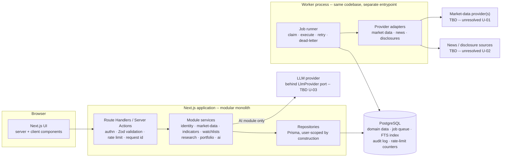
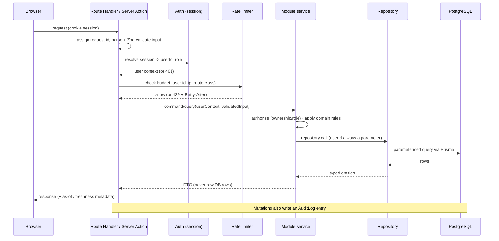
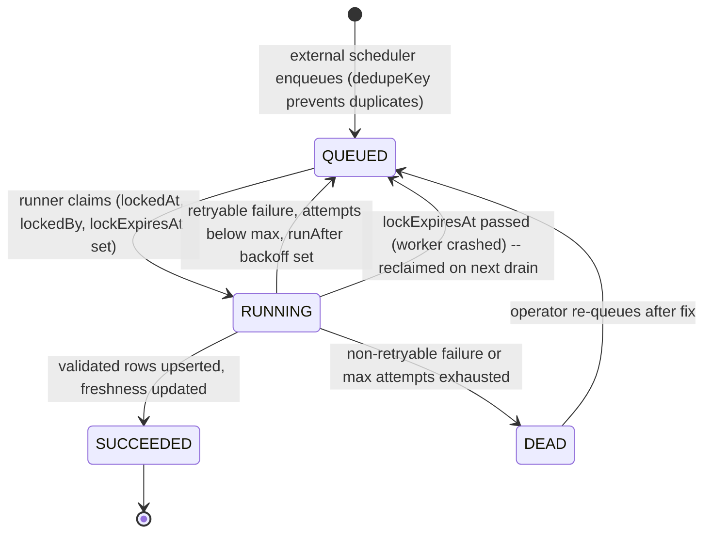
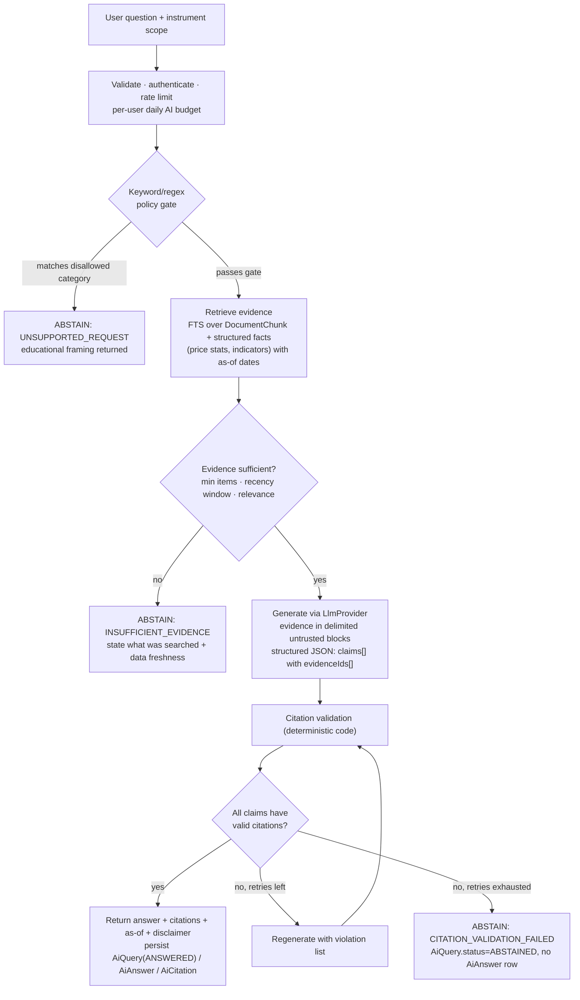

# MarketMind AI — Architecture Overview (Phase 1.1)

Status: **Phase 1.1 — Architecture finalised, pending implementation approval** · Phase: 1 (architecture foundation, no production code)
Related: [decisions.md](./decisions.md) · [data-model.md](./data-model.md) · [security.md](./security.md) · [testing-strategy.md](./testing-strategy.md)

---

## 0. Provenance and repository state

| Item | Finding |
|---|---|
| Repository inspected | The environment used to author this document contained **no repository**: no project files, no `package.json`, no `.git`, no uploads. |
| Consequence | Nothing in these documents is derived from existing code. Everything is greenfield design. |
| Action for the developer | Run `git status && ls -la` in the real project folder. If it contains code, reconcile it against this document before Phase 2 and record differences in `decisions.md`. |

### Labelling convention

Every non-trivial statement is tagged:

- **[Fact]** — stated in the project brief, or true by definition of the chosen tool.
- **[Assumption]** — believed true but **not verified**; must be validated before it is relied on.
- **[Recommendation]** — a design choice proposed by this document; open to review.
- **[Accepted]** — a decision accepted during Phase 1.1 review; recorded in `decisions.md`.
- **[Provisional]** — a placeholder value that must be validated against real data before being treated as final.

No market-data provider, API capability, price, free-tier limit or licence term is asserted anywhere in these documents. Where one is needed, it is listed as a validation task.

---

## 1. Product framing and constraints

- **[Fact]** Financial research and educational platform for Indian equities. Not a brokerage; not an investment-advisory service.
- **[Fact]** Solo developer, intermediate full-stack, 10-12 weeks, target recurring infrastructure cost Rs.0/month.
- **[Fact]** Proposed stack: Next.js App Router + TypeScript, PostgreSQL, Prisma, Zod, an established auth library, modular monolith with a separately runnable worker, provider-independent market-data and AI integrations, automated unit/integration/E2E tests.
- **[Recommendation]** Scope supersedes the earlier, larger PRD direction (layered microservices; graph, vector and time-series stores; 28+ week roadmap) for the MVP. Those capabilities are deferred, not rejected forever. See D-001 and the "Deferred infrastructure" table in `decisions.md`.

### Design principles

1. **Correctness over breadth.** Fewer features, each with provable behaviour (decimal-safe maths, idempotent ingestion, verified citations).
2. **One datastore.** PostgreSQL holds relational data, the job queue, full-text search, audit logs and rate-limit counters until a measured requirement says otherwise.
3. **Providers are replaceable and untrusted.** All external data enters through adapter ports, is validated, and is stored with provenance and a licence flag.
4. **Server is the authority.** Authorisation, validation and rate limiting never rely on the client.
5. **The AI may only say what evidence supports -- otherwise it abstains.**
6. **No advice.** The product explains and informs; it never issues buy/sell/hold recommendations or price targets.

---

## 2. MVP boundaries

Legend: In MVP / Stretch (only if ahead of schedule) / Explicitly out

### 2.1 Stock search and historical price charts

| Scope | Status |
|---|---|
| Search instruments by symbol/name (NSE/BSE equities) from a locally stored instrument master | In MVP |
| Daily OHLCV history charts (1M/6M/1Y/5Y ranges) read from the local database | In MVP |
| Corporate-action-aware (adjusted) series | Stretch -- depends on whether a source supplies adjusted prices or corporate actions (open decision U-04) |
| Intraday / tick data, live streaming quotes | Out |
| Options/futures, mutual funds, crypto, forex | Out |

### 2.2 Basic technical indicators

| Scope | Status |
|---|---|
| SMA, EMA, RSI (Wilder), MACD (12/26/9 default), Bollinger Bands | In MVP -- pure functions over stored daily bars, computed on read (cached), not persisted |
| ATR, ADX, VWAP | Stretch (VWAP needs intraday data, Out for MVP) |
| Signals/alerts/backtesting/screeners | Out |

### 2.3 Watchlists

| Scope | Status |
|---|---|
| Multiple named watchlists per user; add/remove instruments; reorder is optional | In MVP |
| Per-item freshness indicator (last price date) | In MVP |
| Alerts, notifications, sharing/public lists | Out |

### 2.4 Company news and disclosure research

| Scope | Status |
|---|---|
| Ingest news/disclosure metadata and permitted text for tracked instruments through adapters | In MVP -- the set of permitted sources is unresolved (U-02) |
| Per-instrument timeline with source, publish time, link-out | In MVP |
| Full-text search over stored documents (PostgreSQL FTS) | In MVP |
| Storing full article text | Only where the source licence allows (licenseRestriction per document) |
| Sentiment scores, event extraction, knowledge graph | Out |

### 2.5 AI explanations grounded in evidence

| Scope | Status |
|---|---|
| "Explain this" and Q&A scoped to one instrument (and optionally a date window) | In MVP |
| Answers built only from retrieved documents and structured data (prices/indicators), with machine-checked citations | In MVP |
| Abstention with a stated reason when evidence is insufficient or the question asks for advice/prediction | In MVP |
| Streaming responses | Stretch |
| Cross-instrument research agents, tool-using agents, web browsing by the model | Out |
| Price prediction, recommendations, price targets | Out |

### 2.6 Manual portfolio entry and analytics

| Scope | Status |
|---|---|
| Manual BUY/SELL transaction entry (ledger); holdings derived from the ledger | In MVP |
| Allocation by instrument (and by sector if a sector source is validated -- U-06) | In MVP / Stretch |
| Concentration: top-N weight, Herfindahl-Hirschman Index (HHI) on market-value weights | In MVP |
| Unrealised P&L using last stored close and weighted-average cost basis | In MVP |
| CSV import | Stretch |
| Realised P&L, tax lots, XIRR, broker sync, VaR/Sharpe | Out |

### 2.7 Data freshness and ingestion status

| Scope | Status |
|---|---|
| Per-dataset "last successful update", "last data date", state (FRESH / STALE / FAILING) | In MVP |
| User-visible freshness badge on charts, watchlists, portfolio, and AI answers (as-of timestamps) | In MVP |
| Operator view of ingestion runs and failures (admin-only page) | In MVP |
| Public status page, alerting integrations | Out |

### 2.8 Cross-cutting MVP requirements

Authentication, per-user data isolation, rate limiting (counters stored in PostgreSQL -- Accepted DR-07), audit logging, disclaimers ("educational; not investment advice"), timezone correctness (IST trade dates, UTC timestamps).

---

## 3. System architecture

### 3.1 Component diagram



**Worker scheduling -- [Accepted: D-016a]:** The worker starts in **drain-and-exit mode** for MVP. It claims all due jobs, executes them, then exits. An external scheduler (cron, CI schedule, or hosting platform scheduler) invokes it on a defined interval. A long-running polling loop will be added only after the hosting decision (U-09) confirms that an always-on background process is available. The internal scheduler component is therefore an external mechanism in MVP.

### 3.2 Module boundaries (modular monolith)

Each module lives in `src/modules/<name>/` and exposes a small public API (`index.ts`). Other modules import **only** from that API. Pure financial logic lives in `domain/` with no I/O.

| Module | Responsibility | Owns (tables) | May call |
|---|---|---|---|
| `identity` | Sessions, current-user resolution, roles, account lifecycle | User + auth-library tables | `platform` |
| `market-data` | Instrument master, daily bars, corporate actions, freshness reads | Instrument, PriceBar, CorporateAction, DataFreshness | `platform` |
| `indicators` | Pure indicator functions (SMA/EMA/RSI/MACD/Bollinger) and series assembly | none (stateless) | `market-data` |
| `watchlists` | User watchlists and items | Watchlist, WatchlistItem | `market-data`, `platform` |
| `research` | Documents, chunks, full-text search, timelines | Document, DocumentInstrument, DocumentChunk | `market-data`, `platform` |
| `portfolio` | Portfolios, transaction ledger, derived holdings, allocation/concentration maths | Portfolio, Transaction | `market-data`, `platform` |
| `ai` | Retrieval orchestration, prompt assembly, LlmProvider port, citation validation, abstention | AiQuery, AiAnswer, AiCitation | `research`, `market-data`, `indicators`, `platform` |
| `ingestion` | Job queue, runners, provider adapters, run records, freshness updates | DataSource, IngestionJob, IngestionRun | `market-data`, `research` (write APIs), `platform` |
| `platform` | Config/env validation, logging, error types, rate limiter, audit log, HTTP-fetch hardening, clock | AuditLog, RateLimitBucket | none |

**[Recommendation]** Enforce dependency rules with boundary lint (e.g. `dependency-cruiser`) in CI. **[Accepted: SIMPL-01 deferred]** Boundary linting may be deferred until after the module structure stabilises in Phase 2; TypeScript path aliases make violations visible without blocking CI.

### 3.3 Planned repository layout (not created in Phase 1)

```
src/
  app/                      # routes: thin; parse -> call service -> render
  modules/<name>/
    domain/                 # pure logic (decimal maths, indicators, validators)
    service.ts              # use-cases, authorisation checks
    repository.ts           # Prisma access, user-scoped
    schemas.ts              # Zod schemas for module inputs/outputs
    index.ts                # public API
  worker/main.ts            # worker entrypoint: drain-and-exit by default
  lib/                      # db client, logger, config
prisma/                     # schema.prisma, migrations/ (incl. hand-written SQL)
tests/                      # unit/ integration/ e2e/ fixtures/
docs/architecture/
```

---

## 4. Request flow: UI to database



**CSRF protection -- [Accepted, partially]:**

| Request type | CSRF protection mechanism |
|---|---|
| **Server Actions** | Next.js App Router performs origin checking by default for Server Actions. No additional CSRF token required. **[Assumption: verify on the installed Next.js version -- resolved once U-08 auth library is chosen]** |
| **Route Handlers (state-changing)** | Route Handlers do NOT benefit from Server Action CSRF protection. Any Route Handler that mutates state MUST either: (a) use the auth library's CSRF token mechanism (verify library support -- U-08), or (b) be migrated to a Server Action. Each state-changing Route Handler must be explicitly documented with its CSRF mechanism during Phase 2. |

Rules:

1. Validate **before** touching the session or the database (cheap rejection first), but authorise **before** any data access.
2. Services take an explicit `UserContext`; repositories for user-owned data require `userId` as a mandatory parameter so an unscoped query cannot be written by accident.
3. Responses return DTOs and include `asOf`/`dataDate` where data can be stale.
4. Errors map to a small closed set (VALIDATION, UNAUTHENTICATED, FORBIDDEN, NOT_FOUND, RATE_LIMITED, UPSTREAM_UNAVAILABLE, INTERNAL); internals are logged with the request id and never leaked.

---

## 5. Background ingestion lifecycle

**[Accepted: D-016a]** A PostgreSQL-backed queue (IngestionJob) claimed with SELECT FOR UPDATE SKIP LOCKED. Queue is hand-rolled (D-016 leaning). Worker runs in drain-and-exit mode for MVP. **[Accepted: SIMPL-02]** FIFO ordering (ORDER BY runAfter ASC) for MVP; per-source fairness deferred.



**Crashed-job recovery -- [Accepted: DM-01 fix]:**

IngestionJob carries a `lockExpiresAt timestamptz?` column, set at claim time to `lockedAt + configurable_timeout` (recommended default: 10 minutes -- **[Provisional]**). At the start of each drain cycle, before claiming new jobs, the runner executes a reclaim pass:

```sql
UPDATE "IngestionJob"
SET   status = 'QUEUED',
      "lockedAt" = NULL,
      "lockedBy" = NULL,
      "lockExpiresAt" = NULL
WHERE status = 'RUNNING'
  AND "lockExpiresAt" < now();
```

Reclaimed jobs resume within their existing attempt budget. **[Recommendation]** Increment `attempts` at job completion (success or failure), not at claim time, so a clean crash does not consume an attempt unnecessarily. Document this rule in `domain/ingestion/`.

Lifecycle steps:

1. **Reclaim.** Before claiming new jobs, runner reclaims any RUNNING jobs with expired `lockExpiresAt`.
2. **Claim.** Runner claims one due job (status=QUEUED AND runAfter<=now()), sets RUNNING, lockedAt, lockedBy, lockExpiresAt. FIFO order: ORDER BY runAfter ASC FOR UPDATE SKIP LOCKED LIMIT n via $queryRaw.
3. **Fetch.** Adapter calls provider through hardened HTTP client (timeout, size cap, allow-listed host, redirect limit).
4. **Validate.** Zod parses raw payload. Rows failing validation counted and recorded (rowsRejected), not silently dropped; rejection ratio above threshold fails the run.
5. **Sanity-check.** Domain checks: low <= open,close <= high; non-negative volume; no future dates.
   **Abnormal price-movement detection -- [Accepted, Provisional]:** A single-day close-to-close move exceeding +-75% triggers a **warning** (logged, written to IngestionRun.errorSummary). This does **not** automatically reject the bar. The +-75% threshold is **[Provisional]** and must be validated against NSE/BSE historical data (including legitimate large moves from splits/bonuses/rights) before being hardened or changed. Until validated, the flag is informational only.
6. **Persist idempotently.** Upsert by natural key (instrumentId + tradeDate; sourceId + canonicalUrlHash) inside a transaction.
7. **Record.** Write IngestionRun row (counts, duration, outcome, sanitised error) and update DataFreshness.
8. **Retry / dead-letter.** Retryable: network errors, timeouts, 429/5xx. Non-retryable: schema break, 4xx auth errors. Exponential backoff with jitter; max attempts configurable. Dead jobs visible to operator.
9. **Backfill.** Separate job types with lower priority so they cannot starve incremental updates.

**DataFreshness authority -- [Accepted: DM-02 closed]:**

`DataFreshness.state` is a **worker-written cache**. It is written by the worker after each run completion. It is **not** recomputed by the application on read. However, it is **not authoritative** for programmatic decisions -- only for badge display.

Authoritative fields (always read these for logic, not the cached `state`):
- `lastSuccessAt`: timestamp of the last successful run completion.
- `lastDataDate`: latest trade date or document date present in storage.
- `consecutiveFailures`: integer count of consecutive failed runs.

Recomputation rules (worker writes these to `state` after every run):
- `FRESH`: `lastSuccessAt` is within the expected ingestion cadence (cadence definition depends on U-07 holiday calendar).
- `STALE`: `lastSuccessAt` older than expected cadence; consecutiveFailures below failing threshold.
- `FAILING`: consecutiveFailures >= N (configurable; starting value N=3 -- **[Provisional]**).
- `UNKNOWN`: lastSuccessAt IS NULL (no successful run ever).

If the worker crashes between runs, the stored `state` may not reflect the true current state. Any code acting programmatically on freshness (not displaying a badge) must re-derive from the authoritative fields. **[Assumption]** NSE/BSE markets close at 15:30 IST on trading days; the exchange holiday calendar source must be confirmed (U-07).

---

## 6. AI flow: retrieval to generation to citation validation to abstention

**[Recommendation]** Retrieval uses PostgreSQL full-text search plus structured lookups. No vector database; pgvector is a deferred option (D-008).



**Policy gate for disallowed requests -- [Accepted: TV-04 closed]:**

A **deterministic keyword/regex deny-list** runs before any retrieval or LLM call. Categories screened:
- Advice: buy/sell/hold recommendations, "should I invest", portfolio allocation advice.
- Predictions: price targets, price forecasts, "will X go up?", "expected return".
- Out-of-scope: non-equity assets, instruments not in tracked universe.

**Important limitation:** This gate is a first-pass, low-latency filter. It is **not a complete safety guarantee**. Paraphrased requests, role-play framings, or novel formulations may bypass it. The citation validator's output check (check 7 below) provides a second independent layer. Neither layer alone is sufficient; both together reduce risk to an acceptable level for an educational product. The deny-list grows as new bypass cases are discovered. An adversarial test corpus (starter set of 10+ patterns) is part of the automated test suite.

**Retry budget -- [Accepted]:** Maximum retry attempts before abstaining is a configurable constant (recommended initial value: 1 retry = 2 total generation attempts -- **[Provisional]**). Set in the `ai` module configuration.

**Citation validation checks (all deterministic, none LLM-based):**

1. Output parses against the Zod answer schema.
2. Every claim has >= 1 evidenceId, and every evidenceId exists in the retrieved set for this request. A claim with no evidenceId causes the **entire answer to be rejected** -- not stripped (**[Accepted: DR-09]**).
3. Any quoted text is a verbatim substring of the cited evidence (after whitespace normalisation).
4. Any numeric claim attached to structured evidence matches the computed value within a stated tolerance (per-indicator tolerances defined in testing-strategy.md).
5. Evidence recency respects the question's window; stale evidence is labelled with its date.
6. No claim is made without a citation (check 2 enforces this for all claims).
7. Output contains no recommendation language from the deny-list (second-layer defence after the policy gate).

**AiAnswer / AiQuery record rules -- [Accepted: DM-03 closed]:**

- **ANSWERED:** AiQuery.status = 'ANSWERED'. One AiAnswer row written. One or more AiCitation rows written.
- **ABSTAINED (any reason):** AiQuery.status = 'ABSTAINED', abstainReason set. **No AiAnswer row.** No AiCitation rows.
- **FAILED (upstream error):** AiQuery.status = 'FAILED'. **No AiAnswer row.**
- `AiQuery.status` is the **authoritative outcome** for all queries. Do not infer outcome from the presence or absence of an AiAnswer row.

**AiCitation.quote population -- [Accepted]:** The `quote` field on AiCitation **must be populated at citation-write time** by copying from the cited chunk. This ensures the citation remains reviewable if the original DocumentChunk later becomes unavailable (retention, licence takedown, document revision). The UI shows the stored quote with a "source no longer available" notice when documentChunkId resolves to a removed chunk.

**Untrusted-content handling:** retrieved news/disclosure text is data, never instructions. Placed in delimiters; model given no tools or network access; output rendered as escaped text/markdown; URLs in output must come from the evidence set. See security.md SEC-AI-01 through SEC-AI-09.

**Provider independence:** LlmProvider port (generateStructured(request) -> result) with a deterministic FakeLlmProvider for tests. Model name, prompt version and token usage recorded per query.

---

## 7. Cross-cutting runtime concerns

### 7.1 Error handling

- Closed error taxonomy (section 4). Domain errors are typed; unexpected errors are logged with request id and returned as INTERNAL.
- User-facing degradation is explicit: stale dataset or provider down shows last good data with as-of date, not an empty page or fabricated value.

### 7.2 Provider failure isolation

- **Users never trigger live provider calls on the request path.** Reads come from PostgreSQL only. Provider outage degrades freshness, not availability.
- LLM is the one request-path external dependency: strict timeout, bounded retry (idempotent only), circuit breaker (in-process), graceful abstention (UPSTREAM_UNAVAILABLE) when open.
- Per-adapter timeouts, concurrency limits, and per-provider circuit breaker in the worker. One provider failing must not block jobs for another.
- Provider-specific shapes never leak past the adapter; canonical types only.

### 7.3 Retries

- Worker: bounded exponential backoff with jitter, max attempts per job type, dead-letter state.
- Request path: no automatic retries for mutations; at most one retry for idempotent LLM reads.
- Idempotency: ingestion upserts by natural keys; user mutations may accept an optional client idempotency key (decide in Phase 2).

### 7.4 Caching

No Redis in MVP. PostgreSQL is the source of truth.

| Data | Strategy |
|---|---|
| Public instrument/price data | **[Accepted: C-01]** Next.js time-based `revalidate` (e.g. revalidate=3600 for hourly staleness on charts). **Accepted trade-off:** data may lag the latest ingestion by up to the revalidation period. This is acceptable for daily-bar data. Tag-based revalidation from the worker is deferred; the worker does not call an internal endpoint in MVP. |
| Freshness badges | Read DataFreshness rows on demand; stored state is the worker-written cache (section 5). Reflects last worker run. |
| Indicator series | Computed on read; memoised per (instrument, params, last bar date) in-process. |
| User data (watchlists, portfolio) | Not shared-cached; per-request, always user-scoped. |
| AI answers | Optionally cache by (instrument, normalised question, evidence-set hash) only for identical evidence; never across users. |

**Rate-limit counters -- [Accepted: DR-07]:** Stored in PostgreSQL RateLimitBucket table. In-memory counters not used (invalid on serverless or multi-instance hosting).

### 7.5 Observability (minimal, free)

Structured JSON logs with request id, job id, provider key; run history in IngestionRun; health endpoint; no paid APM in MVP.

---

## 8. Delivery outline (indicative, 10-12 weeks)

| Weeks | Focus |
|---|---|
| 1 | Repo bootstrap, CI, config validation, DB + migration baseline, auth skeleton; CSRF behaviour documented per request type |
| 2-3 | Provider-licence validation spike (gate); instrument master; ingestion framework; lockExpiresAt crash recovery; daily bars; freshness |
| 4 | Charts + indicators (golden-tested with stated tolerances); time-based revalidate confirmed |
| 5 | Watchlists + authorisation test matrix |
| 6-7 | Portfolio ledger, holdings (weighted-average cost), allocation/concentration |
| 7-8 | News/disclosure ingestion, chunking, FTS; document content-hash versioning |
| 9-10 | AI module: policy gate, retrieval, grounding, citation validator, abstention |
| 11 | Hardening: rate limits (concrete values), audit, security review, E2E |
| 12 | Buffer, docs, deployment dry-run |

**[Recommendation]** Week 2-3 licence/provider spike is a **gate**: if no legally usable market-data and news source can be found at Rs.0, the scope decision must be taken before further feature work.

---

## 9. Unresolved decisions (summary)

Detail, options and validation steps are in decisions.md.

| ID | Decision | Blocking? |
|---|---|---|
| U-01 | Market-data source(s) and their licence terms | **Yes** |
| U-02 | News/disclosure sources and permitted use | **Yes** |
| U-03 | LLM provider(s), free-tier terms, rate limits, data-use/retention terms | Yes for AI milestone |
| U-04 | Adjusted vs raw prices; corporate-action source | Medium |
| U-05 | Queue: hand-rolled vs library (leaning hand-rolled, D-016) | Medium |
| U-06 | Sector/industry classification source | Low |
| U-07 | Exchange holiday calendar source; freshness cadence definitions | Medium |
| U-08 | Authentication library and sign-in methods | **Yes** -- before Phase 2 |
| U-09 | Hosting for web, worker, and PostgreSQL within Rs.0 | **Yes** |
| U-11 | Treatment of corporate actions in portfolio quantities | Medium |
| U-12 | Data retention (documents, AI queries, audit logs) and user data export/deletion | Medium |
| U-13 | Regulatory/legal review of "educational, not advice" framing | Medium -- before public launch |
| U-14 | Whether audit-log append-only enforcement via restricted DB role is possible on the chosen host | Low |

**Closed in Phase 1.1:** U-10 (rate-limit storage -> PostgreSQL), cost-basis method (-> weighted average), UUID strategy (-> v4), uncited-text policy (-> reject), advice classifier design (-> keyword/regex), worker mode (-> drain-and-exit first), AiQuery/AiAnswer relationship for abstained queries (-> no AiAnswer row), Transaction.userId (-> required), lockExpiresAt for IngestionJob (-> added), cache invalidation (-> time-based revalidate for MVP). See decisions.md for full records.

---

## 10. What this document does not decide

It does not select providers, hosts, or libraries by name where evidence is missing; does not specify UI design; and does not authorise any implementation. **Phase 1.1 architecture finalisation is complete; implementation begins only after developer sign-off.**
